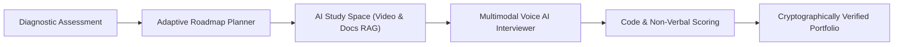

# 🚀 GRIMOIRE: Autonomous AI Career & Employability Platform
**Theme / Domain:** AI for Career Development *(Secondary: AI for Rural Education & Learning)*  
**Project Status:** Functional Working Full-Stack Prototype  
**Live Demo:** `http://localhost:3000` | **API Docs:** `http://127.0.0.1:8000/docs`

---

## 📌 Executive Summary

> **GRIMOIRE** is an end-to-end, autonomous multi-agent AI career acceleration platform. While conventional EdTech platforms leave students stuck in static video tutorials, GRIMOIRE bridges the critical gap between **learning a skill** and **getting hired**. It assesses candidate knowledge gaps, generates customized adaptive roadmaps, conducts real-time voice technical mock interviews with visual body-language feedback, reviews code submissions, and issues cryptographically verifiable credentials.

---

## 🛑 The Problem: The "Tutorial Hell" & Employability Crisis

1. **The Practical Gap:** Over 1.5 million engineering graduates enter the Indian job market each year. Most are caught in "Tutorial Hell"—they complete video courses but freeze during live technical interviews and cannot explain design tradeoffs.
2. **Mentorship Inaccessibility:** 1-on-1 human mock interviews and career coaching cost ₹3,000–₹10,000/hour ($100–$300), putting quality career guidance out of reach for students in Tier-2/3 institutions.
3. **Rigid Curriculums:** Generic syllabi do not dynamically adjust to individual learning speeds or prerequisite gaps.
4. **Resume Verification Deficit:** Static resumes fail to prove hands-on code quality, analytical thinking, or communication skills to hiring recruiters.

---

## 💡 The Solution: How GRIMOIRE Works



GRIMOIRE unifies the entire career journey into **five intelligent phases**:
1. **Diagnose:** Identifies strengths and conceptual blind spots through dynamic diagnostic testing.
2. **Plan & Learn:** Generates tailored, week-by-week learning paths with hallucination-free open educational resources.
3. **Deepen Context:** Ingests external lectures and documentation into local vector databases for instant doubt resolution.
4. **Simulate & Evaluate:** Conducts spoken technical interviews with live code execution and webcam posture/eye-contact tracking.
5. **Verify:** Signs achievements with Ed25519 cryptographic signatures and generates public portfolio URLs.

---

## 🌟 Key Modules & Autonomous Agents

### 1. 🎙️ Multimodal Voice AI Interviewer (`Interview Agent`)
* **Spoken Interaction:** Native Web Speech API for low-latency bi-directional voice dialogue.
* **Computer Vision Analysis:** Base64 webcam frame ingestion via `MediaPipe` detecting posture scores, eye-contact ratio, and facial confidence.
* **Interactive Code Playground:** In-browser multi-language code editor with automated AI review of time/space complexity and edge cases.
* **Domain Scoring:** Multi-axis evaluations (Problem Solving, Communication, Code Quality, System Thinking).

### 2. 🗺️ Adaptive Roadmap Planner (`Planner Agent`)
* **Dynamic Scaffolding:** Calibrates roadmap depth (4 to 30+ modules) based on learner weekly bandwidth and career ambition.
* **Anti-Hallucination Routing:** Enforces deterministic search queries to guarantee all external tutorials and documentation links resolve.
* **Bloom's Taxonomy Scaling:** Automatically simplifies upcoming lessons or introduces bridging modules if user scores drop.

### 3. 🪐 Study Space & Context Ingestion (`Retriever Agent`)
* **Video & Transcript Pipeline:** Extracts transcripts from YouTube lectures and documentation via `yt-dlp` and `youtube-transcript-api`.
* **Vector Indexing:** Stores semantic chunks inside persistent `ChromaDB` localized vector storage.

### 4. 💬 24/7 Context-Aware Doubt Assistant (`Doubt Agent`)
* **Live Streaming:** Low-latency WebSocket connections delivering delta chunks directly to the UI.
* **Role-Based Tutoring:** Acts as an on-demand senior staff engineer answering technical architecture questions.

### 5. 🛡️ Verifiable Credentials & Public Portfolio (`Badge Agent`)
* **Cryptographic Seals:** Emits tamper-proof Ed25519 cryptographic signatures for completed milestones.
* **Shareable Profiles:** Public URLs (`/u/[userId]`) showcasing verified proof-of-work directly to prospective employers.

---

## 🏗️ Technical Architecture & Stack

| Layer | Technologies Used | Purpose |
| :--- | :--- | :--- |
| **Frontend UI/UX** | **Next.js 16 (App Router), React 19, TypeScript, Tailwind CSS 4** | High-performance, reactive interface with dark/light themes |
| **Animations & Visuals** | **Framer Motion, GSAP, Lenis, React Flow, Recharts** | Interactive graph-based roadmaps, smooth transitions & telemetry dashboards |
| **Backend Gateway** | **Python 3.13, FastAPI, Uvicorn, Pydantic 2.9** | Asynchronous high-throughput microservices gateway |
| **AI / LLM Orchestration** | **Groq (Llama 3), Google Gemini, Ollama (Local LLM)** | Multi-tier model routing with key rotation & auto-failover |
| **Vision & Speech** | **MediaPipe, OpenCV Headless, Web Speech API** | Non-verbal body language analysis & client-side speech synthesis/recognition |
| **Vector DB & Storage** | **ChromaDB, Redis, Firebase Firestore, PostgreSQL (Prisma)** | Semantic vector search, caching, relational user profiles & progress persistence |

---

## ⚡ Unique Selling Propositions (USPs)

1. **Working Code vs. Concept Slides:** Unlike typical hackathon ideas, GRIMOIRE features an active Next.js frontend and FastAPI backend with fully connected proxy routes and offline mock fallback capabilities.
2. **Sub-Second Voice Latency:** Uses Groq high-speed inference for realistic conversational rhythm during voice interviews.
3. **Full Lifecycle Platform:** Solves curriculum planning, learning, doubt clearing, interviewing, and candidate verification in one unified ecosystem.
4. **Cost Disruption:** Delivers 1-on-1 personalized mentorship at < ₹5/session compared to ₹3,000+ charged by human coaches.

---

## 👥 Target Audience & Impact

* **Engineering & STEM Students:** Affordable, continuous technical interview preparation.
* **Tier-2 & Tier-3 Colleges:** Standardizes campus recruitment training without hiring costly external training agencies.
* **Hiring Recruiters:** Access to verifiable candidate skill telemetry rather than unvalidated keyword resumes.

---

## 💻 Quick Demo / Local Run Commands

```powershell
# In PowerShell (Project Root):
.\start_all.ps1

# Web App:  http://localhost:3000
# API Docs: http://127.0.0.1:8000/docs
```
